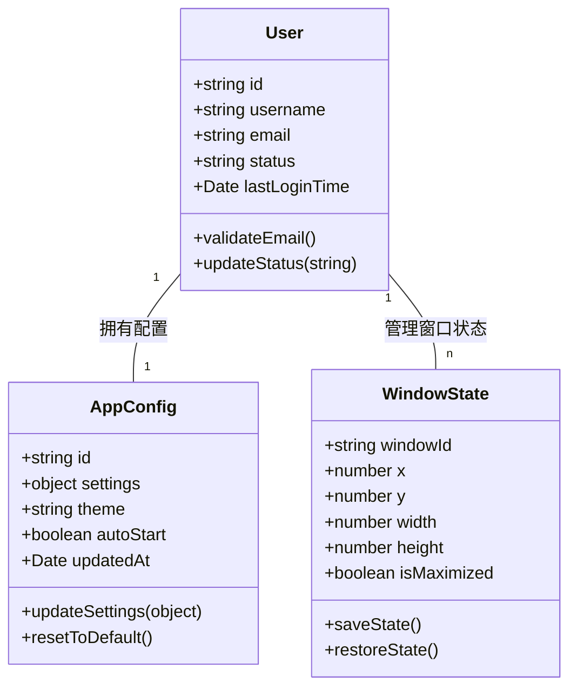
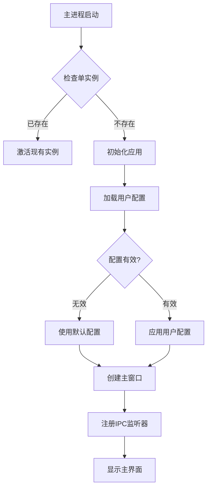

# 项目文档规范

**文档受众明确为软件开发人员**，目的是帮助开发团队快速理解系统架构、业务逻辑和技术实现细节，便于代码维护、功能扩展和知识传递。
## 关键规则
- 项目文档必须包含四个核心部分：项目简介、核心领域模型、项目结构和外部依赖
- 文档应保持客观性，基于现有代码而非理想状态
- 文档中使用的术语必须与代码中的术语保持一致
- 文档应使用Markdown格式，支持图表、表格和代码块
- 代码示例必须是从实际代码中提取的，而非虚构的
- 图表应使用Mermaid或PlantUML语法，以确保可维护性
- 文档应当引用具体的代码文件路径，便于读者查找相关实现
- 所有文档必须统一放置在docs目录下，并使用规定的中文名称
- **文档生成过程中必须确保完整覆盖所有内容，不允许任何遗漏**
## 文档优化与结构指南
- **主索引文档**：每个核心部分创建一个主索引文档，包含子文档链接和简要说明
- **文档内导航**：超过500行的文档必须在开头提供目录
- **分层结构**：按照"金字塔结构"组织（顶层：核心概念；中层：主要功能模块；底层：具体实现细节）
- **文档拆分**：接口超过20个时按业务域拆分；核心实体超过10个时按业务领域拆分
## 文档结构和内容要求
### 1. 项目简介 - docs/项目概述.md
必须包含：项目背景、项目目标、功能概述、技术栈和架构类型
### 2. 核心领域模型 - docs/领域模型说明.md
必须包含：
- 领域模型概述：核心业务概念的定义和边界
- 核心实体关系图：使用E-R图或类图表示
- 关键业务场景下的模型交互
- 数据流转关系
**强制性领域模型扫描规则**：
- **全面扫描**：包括`*Model.js`、`*Model.ts`、`*Entity.js`、`*Entity.ts`、`*Schema.js`、`*Schema.ts`、数据库模型文件、状态管理模型、业务逻辑模型、IPC通信模型
- **按目录结构识别**：位于`models`、`entities`、`schemas`、`stores`、`database`目录及其子目录下的JavaScript/TypeScript文件，以及领域模型专用路径（如`src/models/*`、`src/entities/*`、`src/stores/*`、`src/database/*`）下的文件
- **完整提取**：实体属性和业务含义、实体关系、数据结构、状态管理和数据流转
- **识别规则**：属性约束、实体关系约束、状态转换规则、IPC通信协议
**领域模型分析策略**：
- 全域扫描数据模型和业务对象，支持多种数据存储方案（SQLite、IndexedDB、文件存储等）
- 提取关联关系（通过对象引用、外键关系和数据关联）
- 识别主进程和渲染进程的数据边界（通过IPC通信模式和数据流向）
- 分析继承结构（包括类继承、接口实现和混入模式）
- 提取业务方法和状态转换逻辑（包括Vuex/Redux状态管理）
- 生成完整属性表和业务规则说明
### 3. 接口文档 - docs/接口文档.md
接口文档应确保API接口的完整记录和更新。
### 4. 业务流程 - docs/业务流程说明.md
业务流程文档应确保业务流程的完整记录和更新。
### 5. 项目结构 - docs/项目结构说明.md
必须包含：项目模块划分、代码组织结构、关键包说明、分层架构说明
### 6. 外部依赖与下游服务 - docs/外部依赖说明.md
必须包含：
- 下游服务概述：依赖的所有外部服务列表和用途
- 调用关系图：系统与外部服务的调用关系
## 文档生成工作流程
1. **架构识别**：确定Electron应用架构类型（单窗口/多窗口）、识别主进程和渲染进程组件、分析进程间通信模式
2. **代码分析**：识别核心业务模块和组件、分析数据模型和状态管理、提取IPC接口定义、理解主进程-渲染进程调用链路
3. **内容整理**：按文档结构组织信息、提取代码示例、绘制进程架构图和数据流图
4. **审核完善**：验证文档与代码一致性、补充关键信息、完善架构图和示例
   - **IPC接口覆盖性验证**：确认总览文档中的所有IPC通信接口都在详细文档中有完整描述
   - **进程交互完整性检查**：确保没有遗漏任何必要的主进程-渲染进程交互和数据传递描述
   - **原生模块集成验证**：确认所有Node.js原生模块和系统API调用都有完整记录
5. **定期更新**：与代码审查流程集成、Electron版本升级时更新文档、每季度全面审核
## 示例
### 领域模型示例
```markdown
## 核心实体关系图

## 实体属性详细说明
### User 用户实体
| 属性名 | 类型 | 说明 |
|----|---|---|
| id | string | 用户唯一标识，UUID格式 |
| username | string | 用户名，长度限制：3-20个字符 |
| email | string | 用户邮箱，必须符合邮箱格式 |
| status | string | 用户状态，枚举值：ACTIVE(活跃)、INACTIVE(非活跃)、SUSPENDED(暂停) |
| lastLoginTime | Date | 最后登录时间 |
#### 业务规则
- 用户名必须唯一
- 邮箱格式必须有效
- 用户状态只能按特定流程转换（ACTIVE<->INACTIVE->SUSPENDED）
### 业务流程示例
```markdown
## 应用启动流程
### 核心流程图

### 调用链路
**入口点**: `main.js` 主进程启动
**调用流程**:
1. 单实例检查 - `app.requestSingleInstanceLock()`
2. 应用初始化 - `initializeApp()`
3. 加载用户配置 - `configService.loadUserConfig()`
4. 配置验证 - `validateConfig(config)`
5. 创建主窗口 - `createMainWindow()`
6. 注册IPC通信 - `registerIPCHandlers()`
7. 窗口状态恢复 - `restoreWindowState()`
### IPC通信示例
| 通道名称 | 方向 | 数据格式 | 处理函数 |
|-----|---|----|----|
| user:login | 渲染进程->主进程 | {username, password} | handleUserLogin() |
| config:update | 渲染进程->主进程 | {settings: object} | handleConfigUpdate() |
| window:minimize | 渲染进程->主进程 | {} | handleWindowMinimize() |
| app:ready | 主进程->渲染进程 | {userInfo, config} | - |
### 关键判断点
| 判断点 | 条件 | 处理路径 |
|-----|---|----|
| 单实例检查 | 应用已运行 | 激活现有窗口并退出 |
| 配置加载 | 配置文件损坏 | 使用默认配置并提示用户 |
| 窗口创建 | 显示器配置变更 | 重新计算窗口位置 |