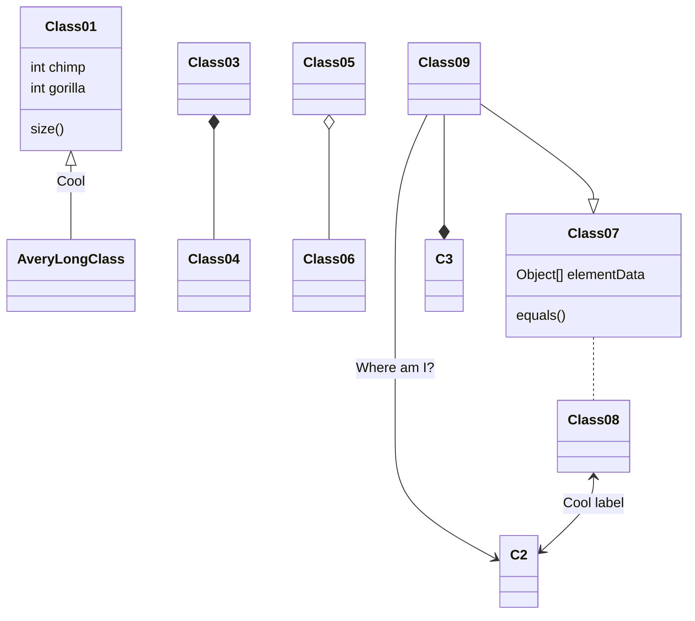
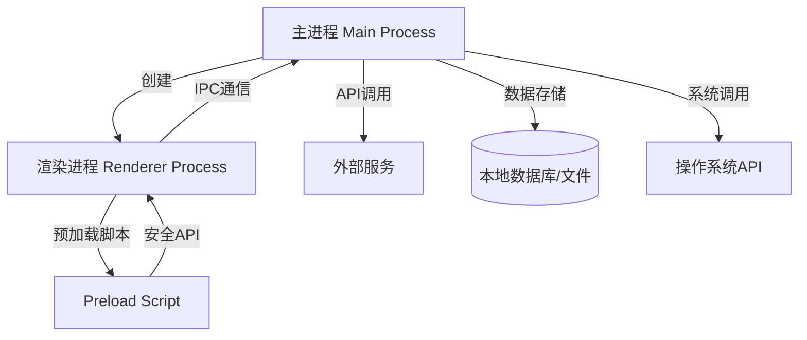
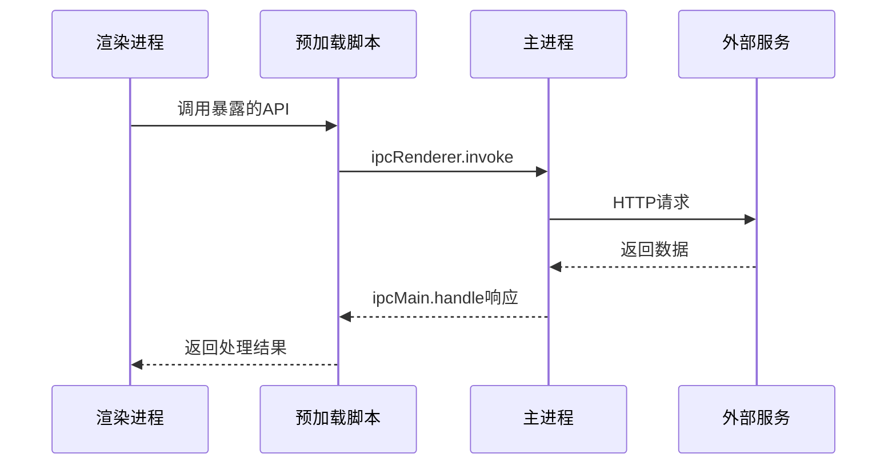

# 技术方案设计文档规范

## 关键规则
- 技术方案文档必须遵循规定的章节结构，包括名词解释、领域模型、应用调用关系和详细方案设计四个主要部分
- 名词解释部分必须建立业务和技术的统一语言，确保术语简单易懂
- 领域模型需清晰表达业务实体及其关系，可使用UML图或ER图进行可视化
- 应用调用关系必须体现主进程与渲染进程间的通信关系、外部API调用关系和数据存储关系
- 详细方案设计应按功能模块和业务流程进行分类，对每个功能的改动点、代码分层和文档变更进行详细说明
- 代码改动点需重点突出实现思路，而不仅是罗列代码变更
- 对外接口协议的所有变更（包括IPC通信、API接口等）必须在接口文档中明确体现
- 首先明确项目使用的Electron架构模式，并选择相应的技术方案设计模板
- 使用现代Electron架构的项目，需明确说明主进程、渲染进程、预加载脚本的职责划分
- 传统Electron项目，应明确说明进程间通信机制和安全策略

## 架构识别与方案适配

### 如何判断Electron项目架构类型

- 现代Electron架构（推荐） ：
  - 启用了上下文隔离（contextIsolation: true）
  - 禁用了Node.js集成（nodeIntegration: false）
  - 使用预加载脚本进行安全的IPC通信
  - 采用了安全的渲染进程配置
- 传统Electron架构 ：
  - 直接在渲染进程中使用Node.js API
  - 未启用上下文隔离
  - 直接使用remote模块或类似机制
- 混合架构 ：
  - 部分功能使用现代架构，部分使用传统架构
  - 正在从传统架构迁移到现代架构的项目

### 方案适配策略

- 使用现代Electron架构的项目，技术方案需关注安全性设计和IPC通信优化
- 传统Electron架构项目，技术方案关注功能实现和性能优化
- 混合架构项目，需要制定迁移策略和兼容性方案
- 在方案开头明确说明项目所使用的架构模式
- 根据架构特点选择适当的设计模式和描述方式

## 技术方案设计文档模板

```markdown
# 技术方案设计文档：[方案名称]

## 文档信息

- 作者：[作者姓名]
- 版本：[版本号，如v1.0]
- 日期：[创建/更新日期]
- 状态：[草稿/已评审/已确认]
- 架构类型：[现代Electron架构/传统Electron架构/混合架构] - Electron版本：[版本号]
- 技术栈：[React/Vue/Angular/Vanilla JS] + [TypeScript/JavaScript]

## 一、名词解释

[建立业务和技术的统一语言，尽量简单易懂]
| 术语 | 解释 |
|------|------|
| 主进程 | Electron应用的主要进程，负责创建和管理渲染进程 |
| 渲染进程 | 负责显示用户界面的进程，基于Chromium |
| 预加载脚本 | 在渲染进程中运行的安全脚本，用于暴露API |
| IPC通信 | 进程间通信，主进程与渲染进程间的数据交换机制 |
| 上下文隔离 | 安全特性，隔离主世界和隔离世界的JavaScript上下文 |
| 术语1 | 含义说明 |
| 术语2 | 含义说明 |

## 二、领域模型

[描述业务领域中的核心实体及其关系，推荐使用UML图表示]

### 核心实体

[列出核心业务实体及其属性、行为]

### 实体关系

[描述实体间的关系，可使用ER图]


## 三、应用调用关系

[体现主进程与渲染进程间的通信关系、外部API调用关系和数据存储关系]

### 系统架构图

[系统整体架构图，展示Electron进程结构和交互关系]


### IPC通信时序图

[关键IPC通信流程的时序图，展示进程间的交互顺序]


## 四、详细方案设计

### 架构选型

[说明本方案采用的Electron架构模式]

### Electron架构说明

[描述本方案的Electron架构，说明各进程职责]

#### 现代Electron架构（推荐）

```
# 主进程（Main Process）
- 职责：应用生命周期管理、创建渲染进程、系统API调用、数据持久化
- 代码位置：src/main/ 目录
- 设计要点：
  - 负责应用的启动和退出
  - 管理所有渲染进程的创建和销毁
  - 处理系统级操作（文件系统、网络请求等）
  - 实现IPC通信的服务端逻辑
# 渲染进程（Renderer Process）
- 职责：用户界面展示、用户交互处理、前端业务逻辑
- 代码位置：src/renderer/ 目录
- 设计要点：
  - 基于Web技术栈（HTML/CSS/JavaScript）
  - 通过预加载脚本与主进程通信
  - 禁用Node.js集成，确保安全性
  - 专注于UI逻辑，不直接访问系统资源
# 预加载脚本（Preload Script）
- 职责：安全的API暴露、IPC通信桥梁
- 代码位置：src/preload/ 目录
- 设计要点：
  - 在隔离的上下文中运行
  - 向渲染进程暴露安全的API
  - 封装IPC通信细节
  - 提供类型安全的接口定义
```

#### 传统Electron架构

```
# 主进程（Main Process）
- 职责：应用生命周期管理、创建渲染进程、部分业务逻辑
- 代码位置：src/main/ 目录
- 设计要点：
  - 应用启动和窗口管理
  - 处理系统级操作
  - 可能包含部分业务逻辑
# 渲染进程（Renderer Process）
- 职责：用户界面展示、用户交互处理、直接的Node.js操作
- 代码位置：src/renderer/ 目录
- 设计要点：
  - 可直接使用Node.js API
  - 通过remote模块访问主进程功能
  - 承担更多的业务逻辑处理
```

### 技术栈设计

[描述技术栈的选择和数据流设计]

```
# 前端框架选择
- Vue + TypeScript：渐进式框架，易于上手
# 状态管理
- Vuex/Pinia（Vue）：Vue生态的状态管理
# 数据持久化
- SQLite：轻量级关系数据库
- LevelDB：键值存储数据库
- JSON文件：简单的配置存储
- IndexedDB：浏览器端数据库
```

### 功能模块1

#### 业务流程1

##### xxx功能

- **功能说明**：[详细说明功能的用途和实现方式]
- **触发方式**：[用户操作/系统事件/定时任务等]
- **数据流向**：渲染进程 -> 预加载脚本 -> 主进程 -> 外部服务/本地存储

##### IPC通信接口

- **接口名称**：[IPC通道名称]
- **通信方向**：[渲染进程->主进程/主进程->渲染进程/双向]
- **请求参数**：
```typescript
interface RequestParams {
  param1: string;
  param2: number;
  // 其他参数
}
```
- **返回结果**：
```typescript
interface ResponseData {
  success: boolean;
  data?: any;
  error?: string;
}
```
#### 功能改动点
[说明功能的改动类型：新增、能力调整、扩展等，并详述改动内容]

#### 代码分层设计
[描述代码的分层结构，确保符合Electron工程规范]

##### 现代Electron架构分层设计
```
# 渲染进程层
- UI组件层：负责界面展示和用户交互

  - 职责：组件渲染、事件处理、状态展示
  - 代码位置：src/renderer/components/
  - 设计要点：组件化设计，单一职责原则
- 业务逻辑层：处理前端业务逻辑

  - 职责：数据处理、业务规则、状态管理
  - 代码位置：src/renderer/services/
  - 设计要点：与UI解耦，可测试性
- API通信层：与主进程通信

  - 职责：封装IPC调用，提供类型安全的接口
  - 代码位置：src/renderer/api/
  - 设计要点：统一的错误处理，请求响应封装
# 预加载脚本层
- API暴露层：向渲染进程暴露安全API
  - 职责：IPC通信封装，API安全控制
  - 代码位置：src/preload/
  - 设计要点：最小权限原则，类型定义
# 主进程层
- 控制器层：处理IPC请求

  - 职责：请求路由、参数验证、响应封装
  - 代码位置：src/main/controllers/
  - 设计要点：统一的请求处理，错误处理
- 服务层：实现核心业务逻辑

  - 职责：业务逻辑实现、外部服务调用、数据处理
  - 代码位置：src/main/services/
  - 设计要点：业务逻辑封装，可复用性
- 数据访问层：数据持久化操作

  - 职责：数据库操作、文件操作、配置管理
  - 代码位置：src/main/repositories/
  - 设计要点：数据访问抽象，事务管理
- 工具层：通用工具和帮助函数

  - 职责：通用功能、工具函数、常量定义
  - 代码位置：src/main/utils/
  - 设计要点：无状态，高复用性
```

##### 传统Electron架构分层设计

```
# 渲染进程层
- UI层：界面展示和交互

  - 职责：DOM操作、事件处理、界面渲染
  - 代码位置：src/renderer/
  - 设计要点：直接的DOM操作，事件驱动
- 业务逻辑层：前端业务处理

  - 职责：数据处理、业务逻辑、Node.js操作
  - 代码位置：src/renderer/js/
  - 设计要点：可直接使用Node.js API
# 主进程层
- 应用控制层：应用生命周期管理

  - 职责：窗口管理、应用启动、系统交互
  - 代码位置：src/main/
  - 设计要点：系统级操作，进程管理
- 业务服务层：后端业务逻辑

  - 职责：数据处理、外部服务调用
  - 代码位置：src/main/services/
  - 设计要点：业务逻辑集中处理
```

#### 安全策略设计（现代Electron架构）

[详细说明安全相关的设计]
```typescript
# 渲染进程安全配置
const secureWindowOptions = {
  webPreferences: {
    nodeIntegration: false,           // 禁用Node.js集成
    contextIsolation: true,           // 启用上下文隔离
    enableRemoteModule: false,        // 禁用remote模块
    preload: path.join(__dirname, 'preload.js'), // 预加载脚本
    sandbox: true,                    // 启用沙箱模式（可选）
  }
};

# 预加载脚本API暴露
const { contextBridge, ipcRenderer } = require('electron');

contextBridge.exposeInMainWorld('electronAPI', {
  // 只暴露必要的API
  openFile: () => ipcRenderer.invoke('dialog:openFile'),
  saveFile: (data) => ipcRenderer.invoke('file:save', data),
  // 禁止直接暴露ipcRenderer
});

# 主进程IPC处理
ipcMain.handle('dialog:openFile', async () => {
  // 参数验证
  // 权限检查
  // 业务逻辑处理
  return result;
});
```

#### 代码改动点
[详述需要改动的代码，重点说明实现思路]
1. 渲染进程改动：
   - 新增XX组件
   - 修改YY业务逻辑
   - 调整状态管理
2. 预加载脚本改动（现代架构）：
   - 新增API暴露
   - 修改IPC通信接口
3. 主进程改动：
   - 新增IPC处理器
   - 修改业务服务
   - 调整数据访问逻辑
4. 配置文件改动：
   - 修改Electron配置
   - 调整构建配置

### 数据存储设计

#### 本地数据库设计

[描述需要新增或修改的本地数据库结构]

##### 数据库选择：[SQLite/LevelDB/其他]

##### 表结构设计

###### 表名：[表名]
| 字段名 | 数据类型 | 是否为空 | 主键 | 注释 |
|-------|---------|---------|------|------|
| id | INTEGER | 否 | 是 | 主键ID |
| ... | ... | ... | ... | ... |

### 配置文件设计

[描述应用配置的存储方式]

#### 配置类型：

[用户配置/应用配置/系统配置]

- 存储位置：[用户数据目录/应用目录]
- 文件格式：[JSON/YAML/INI]
- 配置项：
```json
{
  "setting1": "value1",
  "setting2": "value2"
}
```

### 外部接口设计

[描述与外部服务的接口调用]

### API接口：[接口名]

- 接口地址：[HTTP方法] [URL]
- 调用方式：[主进程调用/渲染进程调用]
- 请求参数：
```json
{
  "param1": "value1",
  "param2": "value2"
}
```
- 返回结果：
```json
{
  "code": 200,
  "message": "success",
  "data": {}
}
```

### 构建和打包配置

[描述构建配置的变更]

#### 构建工具：[electron-builder/electron-forge/其他]

#### 配置变更：

- 新增构建脚本
- 修改打包配置
- 调整资源文件处理

### 非功能性需求

#### 性能需求

[描述性能需求，如启动时间、内存占用、响应时间等]
- 应用启动时间：< 3秒
- 内存占用：< 200MB
- IPC通信延迟：< 100ms

#### 安全需求

[描述安全需求，如数据加密、权限控制等]
- 启用上下文隔离
- 禁用Node.js集成
- 数据传输加密
- 本地数据加密存储

#### 兼容性需求
[描述兼容性需求，如操作系统支持、Electron版本等]
- 支持操作系统：Windows 10+, macOS 10.14+, Ubuntu 18.04+
- Electron版本：>= 20.0.0
- Node.js版本：>= 16.0.0

#### 兼容性与升级方案

[描述应用升级的兼容性问题及升级方案]

#### 数据迁移方案

[描述数据库结构变更时的迁移策略]

#### 配置兼容方案

[描述配置文件格式变更时的兼容策略]

#### 自动更新方案

[描述应用自动更新的实现方案]

### 风险与应对措施

[描述可能的风险及应对措施]

| 风险 | 可能性 | 影响 | 应对措施 |
|------|-------|------|----------|
| 内存泄漏 | 中 | 高 | 定期内存监控，及时释放资源 |
| IPC通信阻塞 | 低 | 中 | 异步处理，超时机制 |
| 安全漏洞 | 低 | 高 | 定期安全审计，及时更新依赖 |
| 跨平台兼容性 | 中 | 中 | 多平台测试，条件编译 |

## 示例

### 代码分层设计

#### 文件管理功能的实现结构如下：

```
# 渲染进程层
- src/renderer/components/FileManager.tsx
  - 职责：文件列表展示，用户交互处理
  - 主要功能：文件选择、拖拽上传、右键菜单
- src/renderer/services/FileService.ts
  - 职责：文件操作的业务逻辑
  - 主要方法：uploadFile(), deleteFile(), renameFile()
- src/renderer/api/FileAPI.ts
  - 职责：封装与主进程的文件操作通信
  - 主要方法：invokeFileOperation(), listenFileEvents()
# 预加载脚本层
- src/preload/filePreload.ts
  - 职责：暴露安全的文件操作API
  - 暴露接口：window.electronAPI.file.*
# 主进程层
- src/main/controllers/FileController.ts
  - 职责：处理文件相关的IPC请求
  - 主要方法：handleFileUpload(), handleFileDelete()
- src/main/services/FileService.ts
  - 职责：实现文件操作的核心逻辑
  - 主要方法：saveFile(), deleteFile(), validateFile()
- src/main/repositories/FileRepository.ts
  - 职责：文件元数据的数据库操作
  - 主要方法：saveFileMetadata(), getFileList()

根据上述设计，文件上传功能的调用链为：
1. 用户在FileManager组件中选择文件
2. 组件调用FileService.uploadFile()
3. FileService调用FileAPI.invokeFileOperation()
4. FileAPI通过预加载脚本调用主进程
5. 主进程FileController处理请求
6. FileController调用FileService执行文件保存
7. FileService调用FileRepository保存元数据
8. 返回结果通过IPC传递回渲染进程
```

## 方案设计工作流程

1. **架构识别阶段**
   - 确定项目使用的Electron架构类型（现代/传统/混合）
   - 识别关键技术栈和依赖组件
   - 确定安全策略和性能要求
   - 选择适合的方案模板
2. **需求分析阶段**
   - 确定功能边界和用户交互流程
   - 识别核心业务实体和数据模型
   - 确定IPC通信接口和外部API调用
   - 识别可能的性能瓶颈和安全风险
3. **方案设计阶段**
   - 根据架构特点进行分层设计
   - 确定进程间通信方案和数据流
   - 设计本地存储结构和配置管理
   - 对于现代架构，设计预加载脚本和安全策略
4. **方案评审阶段**
   - 验证方案与Electron最佳实践的一致性
   - 验证功能覆盖度和完整性
   - 评估性能影响和安全风险
   - 确保方案文档结构清晰、内容完整
